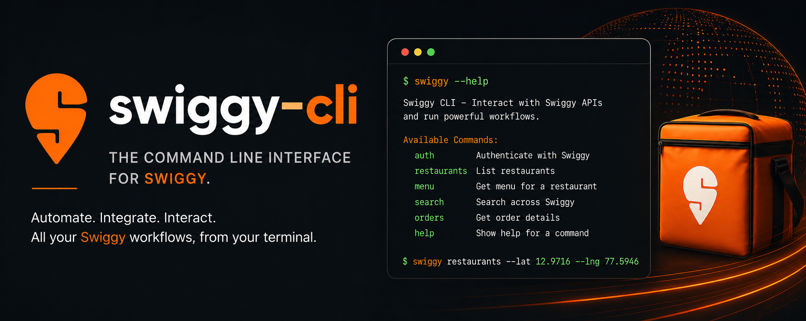

# Swiggy CLI



Swiggy CLI is a command-line wrapper for Swiggy actions into a workflow runtime for everyday software. The core idea is simple: connect apps through MCP, describe higher-level intent as reusable workflows, and let users invoke those workflows the same way they would invoke a skill.


## Idea

The idea is simple: skills.

Coming from a software background, a skill is a reusable workflow bundle that can be linked, shared, and reused to make an existing toolchain smarter. We want the same pattern for everyday apps. Instead of treating each app action as an isolated click or prompt, we can package the decision-making, sequencing, and fallback logic into a workflow that people can invoke again and again.

That matters because most useful app tasks are not one-step commands. They are multi-step outcomes with constraints, tradeoffs, and approvals. A prompt can express intent, but a workflow can encode the repeatable execution pattern behind that intent.

Swiggy CLI is the first proving ground for that idea: MCP gives us the app tools, and workflows give us the reusable intelligence on top.

## Example Complex Workflow

One example of a genuinely reusable workflow is a team offsite meal orchestration skill.

Imagine a founder, office manager, or chief of staff needs to arrange lunch for 26 people across two office floors during a product launch day. The workflow has to:

- split the order into vegetarian, vegan, Jain, high-protein, and no-onion-no-garlic groups
- avoid ingredients flagged by specific teammates
- keep every restaurant within a delivery radius and an arrival window
- balance total budget, packaging charges, and delivery fees
- prefer restaurants with high ratings and low cancellation risk
- avoid repeating cuisines the team already had earlier in the week
- split the order across multiple restaurants if one kitchen cannot fulfill the full requirement
- build fallback carts in case a top restaurant goes offline or key menu items sell out
- produce a reviewable execution plan before placing any order

This is useful as a reusable workflow because the hard part is not just expressing the request in natural language. The hard part is encoding the constraint handling, fallback logic, batching strategy, and execution order in a way that can be trusted and reused every time.

## What Is In This Repo

- `src/` contains the TypeScript CLI, MCP client, current workflow logic, and local development helpers
- `docs/` contains the architecture, roadmap, and change history for the pivot
- `.env.example` lists the runtime configuration used by the CLI and local integrations
- `dist/` is the build output created after `npm run build`

## Current Shape Of The Codebase

The repository is still organized around a practical execution path:

1. `src/index.ts` starts the CLI
2. `src/commands.ts` routes user commands to local logic or the MCP client
3. `src/mcp-client.ts` talks to the external Swiggy MCP server
4. `src/workflows/` contains reusable workflow definitions and planning logic
5. `src/dev/mock-swiggy-mcp.ts` exposes mock MCP tools for local development and demos

That means the docs now describe both the current implementation and the intended pivot toward reusable workflow packages.

## Documentation

- `docs/architecture.md` explains the current code structure and the target workflow-marketplace architecture
- `docs/roadmap.md` explains the product pivot, near-term milestones, and future scope
- `docs/change-log.md` records versioned repository changes, including the documentation pivot

## Setup

```bash
npm install
npm run build
export SWIGGY_MCP_COMMAND=node
export SWIGGY_MCP_ARGS="dist/dev/mock-swiggy-mcp.js"
node dist/index.js help
```

## Environment

The repository uses environment variables for runtime configuration and integration secrets. The full set of example values is in `.env.example`.

Important variables today:

- `SWIGGY_MCP_COMMAND`
- `SWIGGY_MCP_ARGS`

## Local Utilities

- `npm run doctor` checks local configuration
- `npm run mock:mcp` starts the mock MCP server

