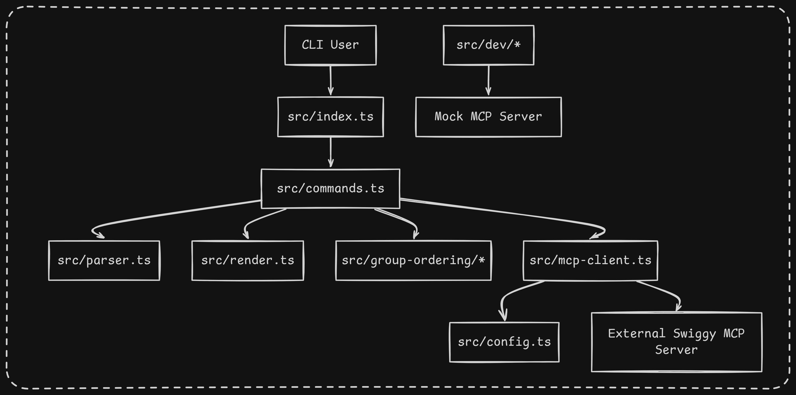
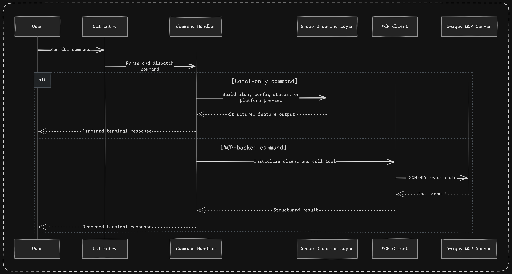
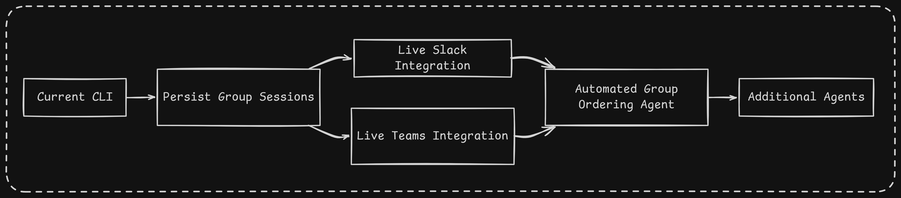

# Architecture

## Purpose

This document explains how the codebase is organized, how requests move through the system, and how the current implementation is intended to evolve after the workflow-marketplace pivot. It is a technical guide for understanding the repository structure, not a business roadmap.

## Design Principles

- Keep the CLI product-facing and easy to operate.
- Keep MCP transport concerns isolated from feature workflows.
- Model higher-level workflows above the raw Swiggy tool layer.
- Distinguish clearly between app capabilities and reusable workflow intelligence.
- Treat Swiggy as the first reference app for a broader workflow runtime pattern.
- Keep sensitive integration configuration outside the codebase and inside environment variables.
- Prefer comments before functions for intent and responsibility; avoid inline comments unless the logic is genuinely tricky.

## High-Level Structure

## Runtime Layers

### 1. CLI Layer

Files:

- `src/index.ts`
- `src/commands.ts`
- `src/parser.ts`
- `src/render.ts`

Responsibilities:

- Accept user input from the terminal
- Parse commands and options
- Route commands either to local feature logic or to the MCP-backed execution path
- Format terminal output in a consistent structure

### 2. MCP Integration Layer

Files:

- `src/config.ts`
- `src/mcp-client.ts`
- `src/types.ts`

Responsibilities:

- Read external MCP process configuration from environment variables
- Start the MCP server process over stdio
- Send JSON-RPC requests and notifications
- Receive and decode JSON-RPC responses
- Expose a small, stable client API to the rest of the CLI

### 3. Feature Workflow Layer

Files:

- `src/workflows/types.ts`
- `src/workflows/catalog.ts`
- `src/workflows/planner.ts`

Responsibilities:

- Define reusable workflow metadata and input contracts
- Store workflow definitions that behave like locally available skills
- Convert a workflow definition plus user payload into an execution plan

This is the layer that is closest to the new pivot. It is now the first implementation of a workflow execution layer that can eventually run reusable marketplace-hosted skills against MCP-backed app tools.

### 4. Development Utility Layer

Files:

- `src/dev/doctor.ts`
- `src/dev/mock-swiggy-mcp.ts`

Responsibilities:

- Validate local configuration without calling the production backend
- Provide a mock MCP server so the CLI can be developed and demonstrated locally

The mock MCP server is especially important after the pivot because it lets the team design workflow abstractions before a live production backend exists.

## Request Flow

## File-by-File Explanation

### `src/index.ts`

The entry point. It decides whether a command is local-only or requires an MCP connection, then manages client lifecycle.

### `src/commands.ts`

The central command registry. This file is intentionally the orchestration layer for CLI behavior. It should stay readable and product-oriented.

### `src/config.ts`

Loads environment configuration for the external Swiggy MCP process.

### `src/mcp-client.ts`

Implements the stdio JSON-RPC client. This file should remain transport-focused and should not absorb business rules.

### `src/workflows/types.ts`

Defines the domain model for reusable workflows, including workflow metadata, input fields, step definitions, and generated execution plans.

### `src/workflows/catalog.ts`

Stores the local workflow catalog that acts as an early stand-in for a future registry or marketplace.

### `src/workflows/planner.ts`

Converts a reusable workflow definition plus user inputs into a workflow plan that references the Swiggy tool sequence required to fulfill it.

This planner is the clearest precursor to a generic workflow engine. It demonstrates how higher-level intent can compile into raw app tool calls.

### `src/dev/doctor.ts`

Checks whether the local environment is configured well enough to start the MCP process.

### `src/dev/mock-swiggy-mcp.ts`

Acts as a lightweight Swiggy MCP simulator for local development and demos.

## Current Boundaries

The codebase currently does not:

- load workflow packages from a marketplace or registry
- resolve a workflow reference into a portable manifest
- execute reusable skills automatically against MCP tool outputs end to end

## Pivot Architecture

The repository is now moving toward a more explicit separation of concerns:

### 1. App Tool Layer

This is the MCP-exposed capability surface. For Swiggy, the mock server already models the shape of this layer with tools such as:

- `search_restaurants`
- `get_restaurant_menu`
- `update_food_cart`
- `get_food_cart`
- `place_food_order`
- `track_food_order`

These tools should stay narrow and composable.

### 2. Workflow Skill Layer

This is the reusable logic layer. A workflow skill should describe:

- intent and metadata
- required user inputs
- selection and filtering constraints
- ranking or fallback logic
- the ordered sequence of MCP tool calls needed for execution

Example: a "healthy high-protein nearby meal" workflow could search restaurants, inspect menus, filter by nutrition proxies and distance, rank by rating, and prepare a cart candidate before final confirmation.

### 3. Workflow Registry Or Marketplace Layer

This is the distribution layer for workflows created by the team or by third parties. The CLI should eventually be able to resolve a workflow identifier, fetch or load its definition, validate compatibility with the current MCP tool surface, and execute it safely.

### 4. CLI Runtime Layer

The CLI remains the user-facing entry point. Its future responsibilities likely include:

- accepting direct commands and workflow references
- binding user-supplied inputs into workflow parameters
- previewing execution plans before mutation-heavy steps
- streaming status back to the terminal in a readable way
- surfacing missing tools, unsupported constraints, and fallback decisions

## Suggested Evolution Path

The practical evolution path now looks like this:

1. keep the Swiggy MCP tool layer stable
2. expand the current workflow planning layer into a generic workflow runtime
3. define a portable workflow package format
4. add local workflow loading and execution
5. add workflow discovery through a registry or marketplace
6. generalize the pattern beyond Swiggy once the execution model is proven

## Commenting Convention

The codebase should use:

- function-level comments that explain purpose and responsibility
- inline comments only when a specific line or branch is genuinely non-obvious

This keeps the code readable without scattering low-value commentary through the implementation.
