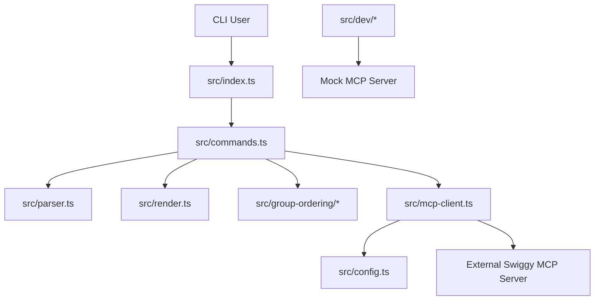
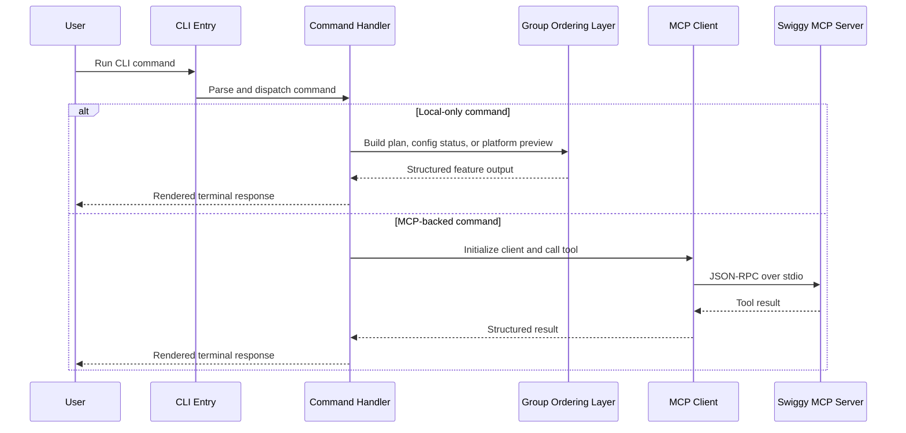
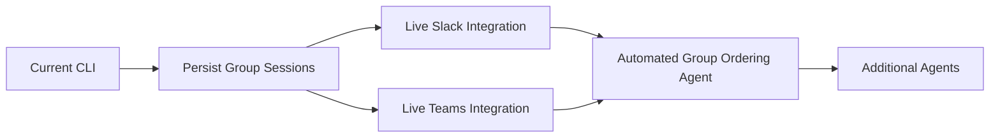

# Architecture

## Purpose

This document explains how the codebase is organized, how requests move through the system, and how the current implementation is intended to evolve. It is a technical guide for understanding the repository structure, not a business roadmap.

## Design Principles

- Keep the CLI product-facing and easy to operate.
- Keep MCP transport concerns isolated from feature workflows.
- Model higher-level business flows, such as Group Ordering, above the raw Swiggy tool layer.
- Keep sensitive integration configuration outside the codebase and inside environment variables.
- Prefer comments before functions for intent and responsibility; avoid inline comments unless the logic is genuinely tricky.

## High-Level Structure

## Runtime Layers

### 1. CLI Layer

Files:

- `src/index.ts`
- `src/commands.ts`
- `src/parser.ts`
- `src/render.ts`

Responsibilities:

- Accept user input from the terminal
- Parse commands and options
- Route commands either to local feature logic or to the MCP-backed execution path
- Format terminal output in a consistent structure

### 2. MCP Integration Layer

Files:

- `src/config.ts`
- `src/mcp-client.ts`
- `src/types.ts`

Responsibilities:

- Read external MCP process configuration from environment variables
- Start the MCP server process over stdio
- Send JSON-RPC requests and notifications
- Receive and decode JSON-RPC responses
- Expose a small, stable client API to the rest of the CLI

### 3. Feature Workflow Layer

Files:

- `src/group-ordering/types.ts`
- `src/group-ordering/platforms.ts`
- `src/group-ordering/planner.ts`
- `src/group-ordering/config.ts`
- `src/group-ordering/adapters.ts`

Responsibilities:

- Define business-level request and response models
- Compare platform capabilities
- Convert a Group Ordering request into a planned Swiggy tool sequence
- Load Slack and Teams configuration from environment variables
- Produce platform-specific launch previews for custom app integrations

### 4. Development Utility Layer

Files:

- `src/dev/doctor.ts`
- `src/dev/mock-swiggy-mcp.ts`

Responsibilities:

- Validate local configuration without calling the production backend
- Provide a mock MCP server so the CLI can be developed and demonstrated locally

## Request Flow

## File-by-File Explanation

### `src/index.ts`

The entry point. It decides whether a command is local-only or requires an MCP connection, then manages client lifecycle.

### `src/commands.ts`

The central command registry. This file is intentionally the orchestration layer for CLI behavior. It should stay readable and product-oriented.

### `src/config.ts`

Loads environment configuration for the external Swiggy MCP process.

### `src/mcp-client.ts`

Implements the stdio JSON-RPC client. This file should remain transport-focused and should not absorb business rules.

### `src/group-ordering/types.ts`

Defines the domain model for Group Ordering, including business requests, platform metadata, integration status, and platform preview outputs.

### `src/group-ordering/platforms.ts`

Holds platform capability definitions for Slack and Microsoft Teams.

### `src/group-ordering/planner.ts`

Converts a business request into a workflow plan that references the Swiggy tool sequence required to fulfill it.

### `src/group-ordering/config.ts`

Loads and validates environment-backed configuration for Slack and Teams custom apps. It also produces a redacted integration status for safe terminal output.

### `src/group-ordering/adapters.ts`

Generates preview payloads that show how a Group Ordering request would be launched inside Slack or Teams.

### `src/dev/doctor.ts`

Checks whether the local environment is configured well enough to start the MCP process.

### `src/dev/mock-swiggy-mcp.ts`

Acts as a lightweight Swiggy MCP simulator for local development and demos.

## Current Boundaries

The codebase currently does not:

- persist Group Ordering sessions
- call live Slack APIs
- call live Microsoft Teams APIs
- optimize carts across team constraints automatically
- provide production authentication flows for collaboration platforms

## Suggested Evolution Path

## Commenting Convention

The codebase should use:

- function-level comments that explain purpose and responsibility
- inline comments only when a specific line or branch is genuinely non-obvious

This keeps the code readable without scattering low-value commentary through the implementation.
